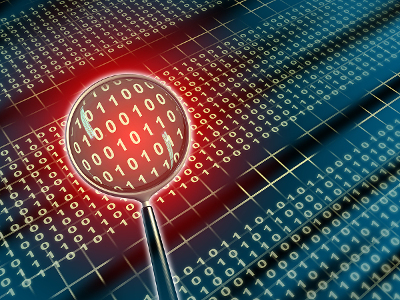
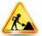

# Reconocimiento de patrones
### Ramón Soto C. [(rsotoc@moviquest.com)](mailto:rsotoc@moviquest.com/)

**NOTA IMPORTANTE** La mayor parte de las carpetas se despliegan muy mal, tanto en el visor de GitHub como en el de nbviewer, por lo que se recomienda descargar las carpetas y visualizarlas localmente.

Este curso ofrece una introducción al área de Reconocimiento de Patrones, con una orientación hacia Data Science, Soft Computing y Minería de opiniones. 

Este es el curso que actualmente imparto en la Lic. en Ciencias de la Computación en la [Universidad de Sonora](www.uson.mx). Los procedimientos están hechos en Python. No se asume un conocimiento profundo del lenguaje, pero tampoco hay una introducción al tema (encontrarán información por todas partes y en particular en el repositorio vecino de [Julio Waissman](https://github.com/juliowaissman/libretasRdP)).
Iremos agregando lecciónes conforme avance el curso. 

La secuencia de temas sugerida es:

* [Intro 1. Bases cognitivas](https://github.com/rsotoc/pattern-recognition/blob/master/1.1. Introducción I.pdf). Una introducción al tema, enfatizando el reconocimiento de patrones como habilidad natural.
* [Intro 2. Bases matemáticas](https://github.com/rsotoc/pattern-recognition/blob/master/Intro%202.%20Bases%20matemáticas.ipynb). Sólo por no encontrar un mejor nombre :-), pero es básicamente una discusión de cómo buscamos sistematizar las tareas de RP, *vectores de características* y discusión inicial de algunos conjuntos de datos de prueba, particularmente el *Pima Indians Diabetes Data Set*. También algunos elementos útiles de Python para análisis de datos.
* [Limpieza de datos I](https://github.com/rsotoc/pattern-recognition/blob/master/Limpieza%20de%20datos%20I.ipynb). Introducción al tema de *preparación de datos*, con énfasis en la *limpieza*. Se analiza el caso de tratamiento de *valores faltantes*.
* [Limpieza de datos II](https://github.com/rsotoc/pattern-recognition/blob/master/Limpieza%20de%20datos%20II.ipynb). Continuación al tema de limpieza de datos. Se discuten el tratamiento a *valores atípicos* y *valores inconsistentes*.
* [Clustering I](https://github.com/rsotoc/pattern-recognition/blob/master/Clustering%20I.ipynb). Introducción al tema de agrupamiento y discusión del tema de las *medidas de distancia*. 
* [Clustering II](https://github.com/rsotoc/pattern-recognition/blob/master/Clustering%20II.ipynb). Discusión de los *dendrogramas*: interpretación y construcción.
* [Clustering III](https://github.com/rsotoc/pattern-recognition/blob/master/Clustering%20III.ipynb). Presentación de la técnica de agrupamiento *k-means*. 
* [Clustering IV](https://github.com/rsotoc/pattern-recognition/blob/master/Clustering%20IV.ipynb). Presentación de la técnica de agrupamiento *ISODATA*.  
* [Clustering V](https://github.com/rsotoc/pattern-recognition/blob/master/Clustering%20V.ipynb). Presentación de la técnica de agrupamiento *DBSCAN*.  
* [Clustering VI](https://github.com/rsotoc/pattern-recognition/blob/master/Clustering%20VI.ipynb). Presentación de una comparación entre técncias de agrupamiento.
* [Clasificación I](https://github.com/rsotoc/pattern-recognition/blob/master/Clasificaci%C3%B3n%20I.ipynb). Presentación del tema y del clasificador *k vecinos próximos*.
* [Limpieza de datos III](https://github.com/rsotoc/pattern-recognition/blob/master/Limpieza%20de%20datos%20III.ipynb). Continuación al tema de limpieza de datos. Se discuten temas como la normalización de datos y evaluación de independencia, componentes pricnipales. Se discute también el manejo de datos faltantes con técncias inteligentes.
* [Clasificación II](https://github.com/rsotoc/pattern-recognition/blob/master/Clasificaci%C3%B3n%20II.ipynb). Presentación de clasificadores bayesianos ingenuos.
* [Clasificación II-B](https://github.com/rsotoc/pattern-recognition/blob/master/Clasificaci%C3%B3n%20II-B.ipynb). Aplicación de los clasificadores bayesianos ingenuos Bernoulli y multinominal a la clasificación de textos. Discusión del área de minería de opiniones.
* [Clasificación III](https://github.com/rsotoc/pattern-recognition/blob/master/Clasificaci%C3%B3n%20III.ipynb). Presentación de los clasificadores por árboles de decisión.
* [Clasificación IV](https://github.com/rsotoc/pattern-recognition/blob/master/Clasificaci%C3%B3n%20IV.ipynb).  Presentación de las máquinas de vectores de soporte (*Support Vector Machines* - SVM).
* [Clasificación V](https://github.com/rsotoc/pattern-recognition/blob/master/Clasificaci%C3%B3n%20V.ipynb). Introducción a los métodos de clasificación del área de Inteligencia Artificial, discusión del uso de metáforas en *machine learning* y de la metáfora neuronal, incluyendo la presentación de la neurona de McCulloch-Pitts, el Perceptrón, la Adaline y las redes Feed-Forward.
* [Clasificación VI](https://github.com/rsotoc/pattern-recognition/blob/master/Clasificaci%C3%B3n%20VI.ipynb). Introducción a los métodos de reconocimiento de patrones bajo el enfoque sintáctico. Se introduce el uso de gramáticas para el reconocimiento de patrones en lenguaje natural y en imágenes. Se hace una introducción al área de procesamiento de lenguaje natural.

* Mas... en un futuro
